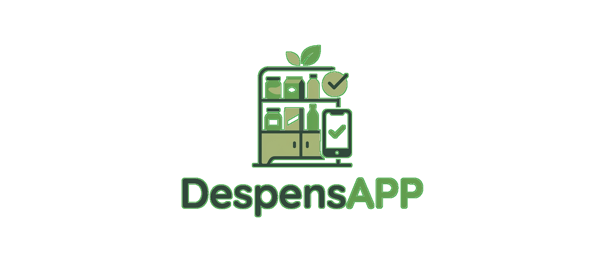

<p align="center">
  
</p>

<h1 align="center">DespensAPP</h1>

<p align="center">
  <strong>Aplicación móvil inteligente para la gestión de despensa del hogar, control de caducidad de alimentos y presupuesto de compras en tiempo real.</strong>
</p>

<p align="center">
  
  
  
  
  
</p>

---

## 📌 Descripción del Proyecto

**DespensAPP** es una aplicación móvil desarrollada en Python con **Kivy** y **KivyMD**, concebida para resolver una problemática cotidiana frecuente: el desperdicio de alimentos por olvido de fechas de vencimiento y la falta de control presupuestario al momento de realizar compras en el supermercado.

El diseño y la arquitectura de la aplicación están respaldados por una **investigación empírica de UX/UI** aplicada a usuarios reales (para más detalle, consultar [FUNDAMENTACION-UX-UI.md](FUNDAMENTACION-UX-UI.md)), identificando patrones de consumo, necesidades de accesibilidad y prioridades funcionales.

---

## ✨ Características Principales

* 🏠 **Inicio Dinámico:** Vista panorámica con resumen de gasto semanal, alertas de alimentos próximos a caducar y sugerencias de recetas para aprovechar insumos existentes.
* 🛒 **Compras con Presupuesto en Vivo:** Carrito interactivo con casillas de verificación, desglose de precios unitarios y cálculo acumulado automático antes de llegar a la caja registradora.
* 🥫 **Despensa e Inventario Inteligente:** Catálogo estructurado de alimentos con código de semáforo visual (*Suficiente*, *Por agotarse*, *Reponer*) para monitorear stock y caducidad de un vistazo.
* 📝 **Listas de Planificación:** Gestión y categorización de compras recurrentes o temáticas (ej: *Compra quincenal*, *Limpieza del hogar*, *Cena de cumpleaños*).
* 📊 **Estadísticas de Consumo:** Indicadores métricos clave (gasto mensual, productos adquiridos), barras de progreso personalizadas y ranking de artículos más comprados.
* 🌗 **Modo Oscuro / Modo Claro Reactivo:** Selector de tema integrado en el modal de perfil de usuario (`theme_cls`), adaptándose a preferencias visuales y reduciendo la fatiga ocular.
* 📱 **Navegación Móvil Ergonómica:** Barra de navegación inferior (*Bottom Dock*) con indicador activo tipo *pill* para desplazamiento fluido a una sola mano.

---

## 🛠️ Stack Tecnológico

* **Lenguaje:** [Python 3.12.10](https://www.python.org/)
* **Framework GUI:** [Kivy](https://kivy.org/) (soporte para renderizado acelerado por hardware y lenguaje kv)
* **Librería de Componentes:** [KivyMD](https://kivymd.readthedocs.io/) (Material Design adaptado a Kivy)
* **Diseño y Estilo Declarativo:** `main.kv` para separación limpia entre interfaz de usuario y lógica de negocio

---

## 📂 Estructura del Repositorio

```text
DespensAPP/
│
├── main.py                   # Punto de entrada de la aplicación y lógica de controladores
├── main.kv                   # Definición de layouts, widgets y estilos gráficos en Kivy
├── FUNDAMENTACION-UX-UI.md   # Informe y matriz de hallazgos UX/UI (muestra n=32)
├── uso_ia.md                 # Registro de prompts, asistencia de IA y resolución de bugs
├── despensapp_logo.png       # Logotipo oficial de la aplicación
├── README.md                 # Documentación general del proyecto
└── venv/                     # Entorno virtual de desarrollo
```

---

## 🚀 Instalación y Ejecución

Sigue estos pasos para ejecutar la aplicación en tu entorno local:

### 1. Clonar el repositorio
```bash
git clone https://github.com/Typrix/DespensAPP.git
cd DespensAPP
```

### 2. Crear y activar un entorno virtual (Python 3.12.10)
* **En Windows (PowerShell / CMD):**
  ```bash
  python -m venv venv
  .\venv\Scripts\activate
  ```
* **En Linux / macOS:**
  ```bash
  python3 -m venv venv
  source venv/bin/activate
  ```

### 3. Instalar dependencias
```bash
pip install --upgrade pip
pip install "kivy[base]" kivymd
```

### 4. Iniciar la aplicación
```bash
python main.py
```

> **Nota:** La aplicación está configurada para emular una resolución móvil estándar de **390 × 780 px**.

---

## 🎨 Fundamentación UX/UI

La aplicación fue desarrollada siguiendo un enfoque centrado en el usuario (*Human-Centered Design*):

1. **Investigación:** Encuesta cuantitativa (n=32) en Temuco que evidenció que el **68.8%** pierde frutas/verduras por olvido y el **88.2%** necesita llevar control presupuestario previo a caja.
2. **Decisiones cromáticas:** Paleta con tono azul dominante (elegido por el 57.1% de los encuestados) complementado con soporte obligatorio de Modo Oscuro (solicitado por el 50% de la muestra).
3. **Carga cognitiva mínima:** Alertas por códigos cromáticos (verde, naranja, rojo) para lectura inmediata sin sobrecarga de texto.

Para leer el desglose completo de la investigación, revisa el archivo [FUNDAMENTACION-UX-UI.md](FUNDAMENTACION-UX-UI.md).

---

## 👥 Equipo de Desarrollo

Proyecto desarrollado de forma colaborativa por:

| Integrante | Usuario GitHub |
| :--- | :--- |
| **Luis Ignacio Cerda Zurita** | [@Typrix](https://github.com/Typrix) |
| **Carlos Sepúlveda** | [@sidhartaz](https://github.com/sidhartaz) |
| **Sebastian Victoriano** | [@swix14](https://github.com/swix14) |
| **Sebastián Ayenao** | [@seba12432](https://github.com/seba12432) |
| **Braulio Palma** | [@brauliodeus](https://github.com/brauliodeus) |

---

## 📄 Licencia

Este proyecto fue desarrollado con **fines exclusivamente académicos y educativos** para la carrera universitaria. Todos los derechos reservados a los autores.
